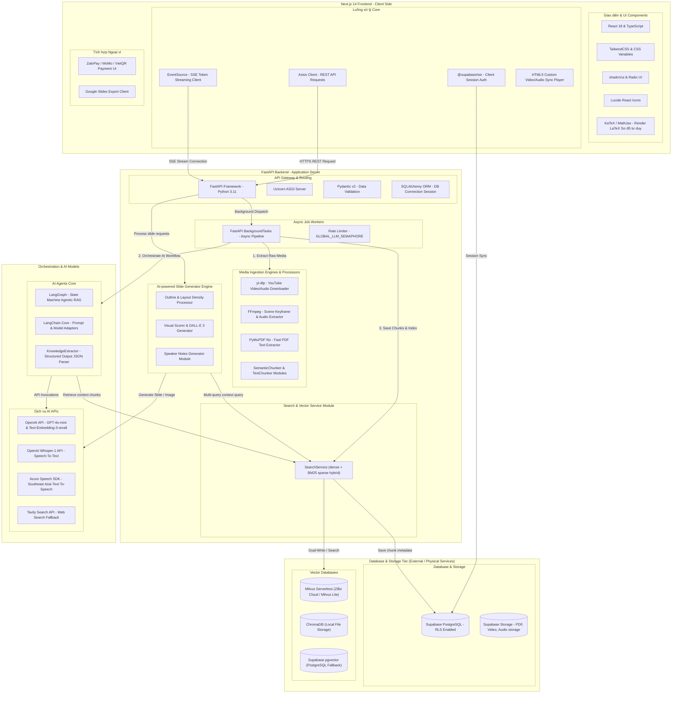
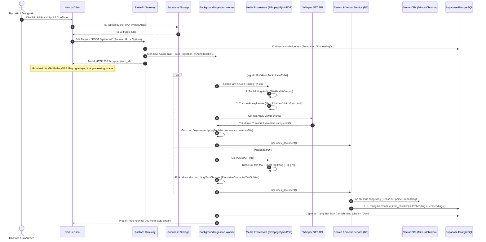
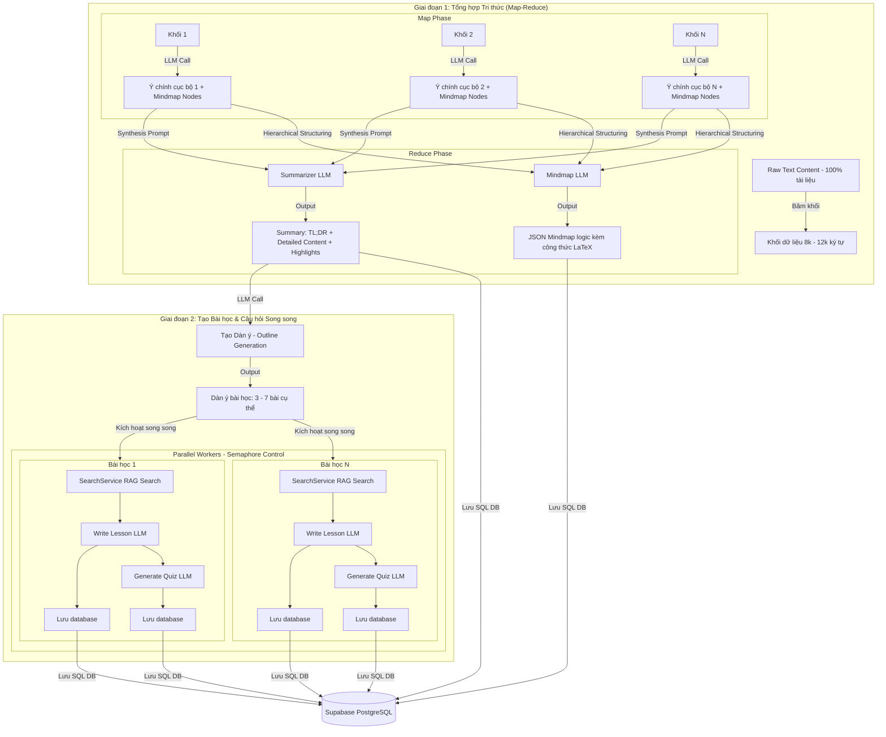
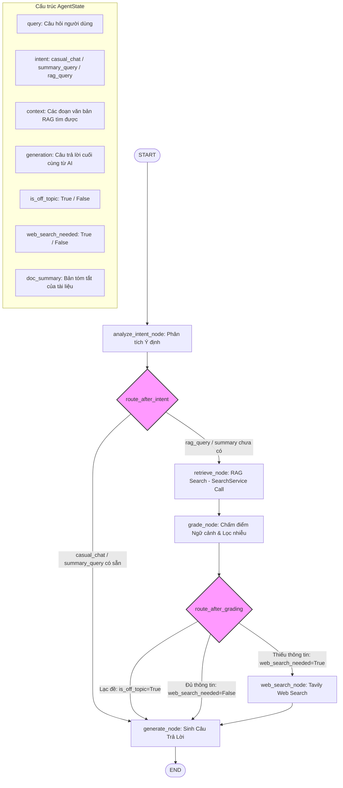

# Tài liệu Kiến trúc & Luồng xử lý Hệ thống AI-Powered LMS (InsightAI)

> **InsightAI** sử dụng kiến trúc AI tiên tiến dựa trên **Agentic RAG (LangGraph)** kết hợp **Multimodal Ingestion Pipeline** và **Hybrid Vector Search (Milvus)** để chuyển đổi tài liệu thô thành tài nguyên học tập thông minh.

---

## 1. Sơ đồ Kiến trúc & Công nghệ Toàn diện (System Architecture & Tech Stack Map)

Sơ đồ này phân tích chi tiết các thành phần hệ thống từ Frontend (FE) đến Backend (BE), chỉ rõ các thư viện, framework, dịch vụ đám mây và cơ sở dữ liệu được tích hợp:

---

## 2. Phân rã Luồng xử lý chi tiết (Granular Flow Decomposition)

### 2.1. Ingestion Pipeline - Tiền xử lý Đa phương tiện Chi tiết

Luồng băm nhỏ và xử lý từng tệp tin đầu vào từ lúc người dùng tải lên cho đến khi lưu trữ Vector:

---

### 2.2. Enrichment Pipeline - Quy trình Map-Reduce & Agentic Generation

Luồng xử lý logic của AI Worker khi tổng hợp tri thức, tạo bài học chi tiết và sinh câu hỏi trắc nghiệm song song:

---

### 2.3. Agentic RAG Chatbot - Sơ đồ Trạng thái LangGraph Chi tiết

Sơ đồ mô tả chi tiết đường đi của dữ liệu, cấu trúc của `AgentState` và các bộ định tuyến có điều kiện (Conditional Routers) bên trong LangGraph:

---

## 3. Các Giải pháp Kiến trúc Đặc trưng & Điểm nhấn Kỹ thuật (Technical Highlights)

Sau khi đánh giá trực tiếp mã nguồn, dưới đây là các điểm sáng kỹ thuật mang tính đột phá của **InsightAI** giúp nâng cao điểm chất lượng dự án trước Ban giám khảo (BTC):

### 3.1. Registry Pattern Cho Ingestion Engines & Thread-Safe Operations

- **Kiến trúc:** Hệ thống sử dụng thiết kế **Registry Design Pattern** (`IngestionRegistry`) để quản lý các processor nạp tài liệu một cách động.
- **Chi tiết:** Đối với các tác vụ I/O thô hoặc tính toán nặng (như băm mở file PDF lớn bằng `PyMuPDF` hoặc tách keyframes bằng `FFmpeg`), FastAPI đã triển khai việc cô lập và chạy trên **Thread Pool** thông qua `anyio.to_thread.run_sync`. Điều này giúp đảm bảo **không làm nghẽn Event Loop** bất đồng bộ của FastAPI, đảm bảo tính đáp ứng đồng thời (Concurrency) cao khi có hàng trăm request gửi tới.

### 3.2. PyMuPDF Page-Marker Injection (Kỹ thuật bảo toàn trang)

- **Kỹ thuật:** Khi đọc tệp PDF, `PDFProcessor` tự động tiêm marker trang dạng `[P{page_num}]` vào đầu từng dòng văn bản thô.
- **Ý nghĩa:** Khi văn bản đi qua bộ băm chunk (`TextChunker`), các chunks văn bản vẫn luôn mang theo số trang tương ứng. Nhờ đó, Agent RAG khi truy xuất ngữ cảnh có thể đưa ra dẫn chứng chính xác tuyệt đối: **"Thông tin được tìm thấy tại Trang X của tài liệu"** thay vì trả lời mơ hồ, tăng độ tin cậy của câu trả lời.

### 3.3. Whisper-based Semantic & Temporal Chunker (Bộ băm ngữ nghĩa & thời gian)

- **Kỹ thuật:** Đối với video/audio, sau khi trích xuất phụ đề thô bằng OpenAI Whisper-1, hệ thống sử dụng thuật toán gom cụm ngữ nghĩa động (`SemanticChunker`):
  1. Tính độ tương đồng ngữ nghĩa giữa các câu liên tiếp bằng **Cosine Similarity** trên Vector Embeddings (`text-embedding-3-small`).
  2. Phát hiện các **Từ khóa chuyển cảnh** tự nhiên như: _"tiếp theo"_, _"chúng ta sẽ sang"_, _"kết thúc phần"_.
  3. Đo lường khoảng lặng **Time Gap** giữa các mốc phát âm (`start` và `end` time) nếu lớn hơn 5.0 giây.
  4. Gom cụm động dựa trên điều kiện tích lũy thời gian tối thiểu (`min_duration = 180s`).
- **Ý nghĩa:** Đảm bảo các đoạn trích xuất kiến trúc video không bị cắt nửa chừng hay gãy câu giữa chừng, bảo toàn trọn vẹn mạch tư duy bài giảng.

### 3.4. Hybrid & Multi-tiered Vector Search (Tìm kiếm vector đa tầng)

- **Kiến trúc:** Search Service (`search_service`) triển khai cơ chế tìm kiếm lai (Hybrid Search) nâng cao:
  - **Milvus Serverless:** Thực hiện tìm kiếm lai giữa **Dense Query** (độ tương đồng ngữ nghĩa) và **Sparse Query** (tần suất từ khóa BM25) rồi gộp kết quả qua **WeightedRanker(0.7, 0.3)**.
  - **ChromaDB:** Lớp cơ sở dữ liệu vector local đóng vai trò cache và dự phòng khi mạng Internet/Milvus Cloud gặp sự cố.
  - **PostgreSQL pgvector:** Lớp vector dự phòng cuối cùng lưu trữ vĩnh viễn embeddings trực tiếp cùng metadata của chunks văn bản.

### 3.5. Dual-engine Web Search Fallback with Content Guardrails

- **Kỹ thuật:** Khi LLM-as-a-judge (`grade_node` trong LangGraph) đánh giá ngữ cảnh tài liệu nội bộ thiếu thông tin, nó kích hoạt Web Search.
- **Bảo vệ:** Lớp Web Search sử dụng **Query Transformation** biến đổi lịch sử chat thành từ khóa chuyên sâu kèm từ khóa phủ định (`-bet -casino -nhà cái`) để tránh rác thông tin.
- **Dự phòng:** Sử dụng **Tavily Search API** làm cổng chính, tự động fallback về **DuckDuckGo Search (DDGS)** chạy lọc danh sách đen (Blacklist Filtering) khi Tavily hết hạn ngạch hoặc lỗi.

### 3.6. AI-powered Slide Generation Engine (Trình biên dịch Presentation nâng cao)

- **Quy trình:** Module `slides.py` là một slide engine thông minh kết hợp đa mô hình:
  - **Layout Density Profiles:** Tùy chọn 4 giao diện thuyết trình độc đáo (`business`, `creative`, `academic`, `children`). Mỗi loại sẽ tự động áp dụng mật độ chữ, số lượng câu, giới hạn từ ngữ (Max 15 từ/bullet) để slide tinh gọn nhất.
  - **Selective Visual Scorer:** Chạy thuật toán chấm điểm tiềm năng hình ảnh (`_score_slide_for_visual`). Tự động cộng điểm cho các slide mô tả "quy trình", "kiến trúc", "giải pháp" để ưu tiên tạo prompt hình ảnh minh họa bằng **DALL-E 3** (hoặc Pollinations AI).
  - **Parallel Multi-query Context Compilation:** Để viết slide chuẩn nhất, hệ thống chạy **10 luồng tìm kiếm song song** dựa trên dàn ý đề xuất để gom đủ `14,000` ký tự ngữ cảnh đặc thù từ Vector DB.
  - **AI Speaker Notes Generator:** Tự động sinh kịch bản thuyết trình chi tiết tương thích hoàn toàn với phong cách trình bày được chọn (Ví dụ: business sẽ executive, creative sẽ storytelling...).

---

## 4. Bản đồ Công nghệ Chi tiết (Tech Stack Summary Table)

Để hỗ trợ bạn cập nhật nhanh thông tin này vào Slide Pitch Deck hoặc hồ sơ nộp dự án, dưới đây là bảng phân bổ công nghệ của toàn bộ dự án:

| Tầng Hệ thống         | Công nghệ / Thư viện sử dụng                  | Vai trò & Mục đích sử dụng                                           |
| :-------------------- | :-------------------------------------------- | :------------------------------------------------------------------- |
| **Frontend UI**       | Next.js 14, React 18, TypeScript, TailwindCSS | Xây dựng giao diện web phản hồi nhanh (Responsive SPA).              |
| **UI Components**     | shadcn/ui, Radix UI, Lucide Icons             | Cung cấp các nút, popup, sidebar theo chuẩn Premium UX/UI.           |
| **Math Render**       | KaTeX, LaTeX integration                      | Hiển thị công thức toán học sắc nét trong Sơ đồ tư duy và Quiz.      |
| **Audio Processing**  | HTML5 Audio API, WaveSurfer                   | Đồng bộ thời gian thực mốc phát âm thanh và chữ chạy.                |
| **Backend Framework** | FastAPI, Uvicorn, Python 3.11                 | Cung cấp RESTful APIs tốc độ cao và hỗ trợ stream dữ liệu SSE.       |
| **Data Validation**   | Pydantic v2, SQLAlchemy ORM                   | Đảm bảo tính toàn vẹn dữ liệu từ API Gateway xuống Database.         |
| **Downloader**        | `yt-dlp`                                      | Tự động tải luồng video/audio chất lượng từ link YouTube.            |
| **Media Processor**   | `FFmpeg`                                      | Cắt cảnh video thành keyframes và trích xuất tệp WAV.                |
| **Document Parser**   | `PyMuPDF`                                     | Trích xuất text cực nhanh từ tệp PDF nhiều trang.                    |
| **AI Orchestration**  | LangGraph, LangChain Core                     | Thiết kế Agentic RAG thông minh bằng máy trạng thái.                 |
| **AI Models (LLMs)**  | OpenAI GPT-4o-mini, GPT-4o                    | Xử lý ngôn ngữ, chấm điểm RAG, viết bài học và sinh câu hỏi.         |
| **STT Engine**        | OpenAI Whisper-1                              | Chuyển đổi tệp ghi âm giọng nói thành văn bản có mốc thời gian.      |
| **TTS Engine**        | Microsoft Azure Text-to-Speech                | Cung cấp giọng đọc nhân tạo cực sinh động cho Voice Chat.            |
| **Web Search**        | Tavily Search API                             | Lớp tìm kiếm Internet fallback khi tài liệu nội bộ thiếu thông tin.  |
| **Vector DB Primary** | Milvus Serverless (Zilliz Cloud)              | Hybrid Search: Tìm kiếm kết hợp ngữ nghĩa và từ khóa (Dense + BM25). |
| **Vector DB Local**   | ChromaDB                                      | Cơ sở dữ liệu vector chạy cục bộ phục vụ cache/embed nhanh.          |
| **Fallback DB**       | PostgreSQL (Supabase `pgvector`)              | Lớp vector fallback an toàn, lưu trữ vĩnh viễn embeddings.           |
| **Relational DB**     | Supabase PostgreSQL                           | Quản lý người dùng, phân quyền RLS, lưu tiến độ bài học, billing.    |
| **Object Storage**    | Supabase Storage                              | Lưu trữ tệp thô vật lý (.pdf, .mp3, .mp4).                           |
| **Payment Gateway**   | ZaloPay, MoMo, VietQR APIs                    | Tích hợp hệ thống thanh toán quét mã QR nạp credit tự động.          |
